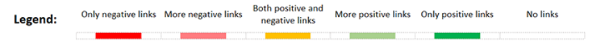

```{r setup, include=FALSE}
knitr::opts_chunk$set(
	echo = TRUE,
	message = FALSE,
	warning = FALSE
)
library(readxl)
library(data.table)
library(tidyverse)
library(reactable)
library(stringi)
library(htmltools)

### Load data
dfa = read_excel("Lit Review Matrix - Upstream Policies and Health Outcomes 6-28-21.xlsx") %>% 
  rename( "policy" = 1)
policiesAll = dfa$policy
outcomesAll = names(dfa %>% select(-1))

```

**Broad goal of this report is describe the simulation of data to be used in dashboard prototype**

# Categories of Policy/Outcomes to simulate

## Policies

I reorganized the original policies by adding some directional policy names, policy groups and prior beliefs. The Prior beliefs column is meant to refelct our prior assumptions to do some data simulation: Positive means the policy in the 'Policy Short' column has a positive effect on the health outcome; Negative means the associated policy has a negative effect on the health outcome. The last column (Z-score) is just an assumed effect size used for the simulation.

```{r echo=FALSE}

df_policies = read_excel("Lit Review Matrix - Upstream Policies and Health Outcomes 6-28-21.xlsx", sheet = "policy group")
df_policies %>% reactable()
```

## Outcomes

Some outcomes were renamed to be shorter. No major changes.

```{r echo=FALSE}

df_outcomes = read_excel("Lit Review Matrix - Upstream Policies and Health Outcomes 6-28-21.xlsx", sheet = "outcome groups")
df_outcomes %>% reactable()
```

# Data Simulation

## Data Format

The input for this data tool should contain the at least following columns:

-   paper title
-   policy (exposure)
-   Health Outcome
-   Link: Negative (when policy results in worse health outcome) or Positive (when policy results in better health outcome)

```{r echo=FALSE}
template = fread("bchc_lit_review_matrix.csv") %>% as_tibble() %>% 
  select(Title = 2, Policy,  Outcome, Link  )
reactable(template)
```

## Simulate quantity and priors

We will want to simulate data in the format above. With several parameters that each policy/outcome link should have between 0 - 10 papers and the proportion of the positive/negative links among the policy/outcomes should approximate the prior assumptions in our Policies table.

For each policy/outcome pair simulate the number of papers available (0 - 10) using binomial distribution, then approximate the prior of each policy into each policy/outcome pair using normal distribution.

```{r}
### For each policy/outcome pair simulate the number of papers available (0 - 10) with approximate prior effect
df_sim_raw = df_policies %>% 
  select(policy =`Policy Short`, 
         prior = `Prior Z Score`) %>% 
  mutate(prior_dir = ifelse(prior>=0,1,-1),
         prior = abs(prior))
set.seed(123)
df_n_paper = df_sim_raw %>% 
  mutate(policyGrouper = policy) %>% 
  group_by(policyGrouper) %>% 
  group_modify(~{
    df_tmp = .x
    df_n_papers_tmp = tibble(
      policy = df_tmp$policy,
      outcome = outcomesAll,
      nPapers =  rbinom(length(outcomesAll),
                        10,0.15),
      prior = rnorm(length(outcomesAll),
                    0.8,
                    0.2) %>% 
        round(4) ,
      prior_dir = df_tmp$prior_dir) %>% 
      mutate(prior =  ifelse(prior>1,1,prior))
    df_n_papers_tmp
  }) %>% 
  ungroup() %>% 
  select(-contains('Grouper'))
reactable(df_n_paper)
```

So for each policy/outcome pair we now have simulated number of papers reviewed and effect size of each pair. The next step is to simulate the actual papers them selves.

```{r echo=FALSE}
set.seed(123)
df_simulate_output = df_n_paper %>%
  mutate(Grouper = row_number()) %>% 
  group_by(Grouper) %>% 
  group_modify(~{
    df_tmp =  .x 
    if (df_tmp$nPapers>0){
      links_tmp = rbinom(df_tmp$nPapers,1,df_tmp$prior) %>% 
        as.character() %>% 
        list()
      df_tmp %>% 
        mutate(link = links_tmp) %>% 
        unnest() %>% 
        mutate(Link = case_when(
          link==1&prior_dir==1~"Positive",
          link==0&prior_dir==1~"Negative",
          link==1&prior_dir==-1~"Negative",
          link==0&prior_dir==-1~"Positive") ,
          Title = stringi::stri_rand_strings(df_tmp$nPapers, 15)) %>%
        select(Title,Policy = policy, Outcome =  outcome, Link)
    } else { #if no papers then don't return anything!
      tibble()
    }
    
  }) %>% 
  ungroup() %>% 
  select(-Grouper)
save(df_simulate_output, file = "df_simulate_output.rdata")
reactable(df_simulate_output)
```

Great now we have a simulated dataset. Lets do a summary table to make sure the results are as expected.

# Simulate Output Table

<div style="display: grid;justify-items: center; padding-bottom: 10px;">
</div>

```{r echo=FALSE, R.options = list(width = 333)}

### Transform output into table
df_table = df_simulate_output %>% 
  count(Policy,Outcome,Link) %>% 
  pivot_wider(names_from = "Link", 
              values_from = n, 
              values_fill = 0) %>% 
  mutate(diff = Positive-Negative,
         nPaper = (Positive+Negative),
         Status = case_when(
           diff>0&Negative==0~"po",
           diff>0&Negative>0~"ps",
           diff==0~"bo",
           diff<0&Positive==0~"no",
           diff<0&Positive>0~"ns"
         )) %>% 
  select(Policy, Outcome, Status) %>% 
  pivot_wider(names_from = "Outcome", values_from = Status, 
              values_fill =   "np")

reactable(df_table %>% select(1:5,8:10),
          defaultPageSize  = 40,
          defaultColDef = colDef(
            cell = function(value) {
              class <- paste0("status status-", value)
              div(class = class, value)},
            minWidth = 100),
          columns = list(
            Policy = colDef(
              cell = function(value) {
                class <- "policyCol"
                div(class = class, value)
              },
              minWidth = 160)),
          theme = reactableTheme(
            # Vertically center cells
            cellStyle = list(display = "flex",
                             flexDirection = "column",
                             justifyContent = "center")
          )
  )

```


```{r}


```

